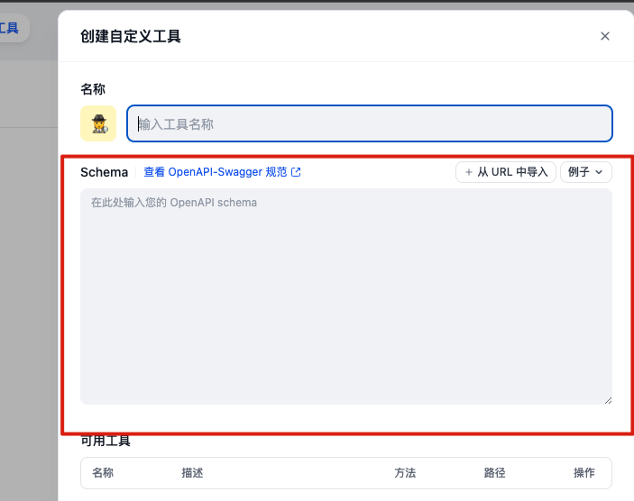

# Python Interpreter API

这是一个 Python 的解释器，可以通过 API 的方式执行 Python 代码。不仅可以捕获 print 的输出，还可以捕获非 print 以及一些异常的输出。

## 说明

> 核心部分是从[Qwen-Agent](https://github.com/QwenLM/Qwen-Agent/blob/main/qwen_agent/tools/code_interpreter.py)中提取出来的，并进行了一些修改。

## 安装和启动

### 环境安装

```bash
conda create -n py_interpreter_api python=3.8
conda activate py_interpreter_api
pip install -r requirements.txt
```

### 服务启动

```shell
python app.py
```

### 测试

执行下面的命令，可以看到输出结果。

```python
python demo.py
```

## Dify 配置使用

1、创建自定义工具

2、复制配置

只需要把[接口配置](dify_config.json) 粘贴到下面就好啦



## 参考

[1] https://github.com/QwenLM/Qwen-Agent
